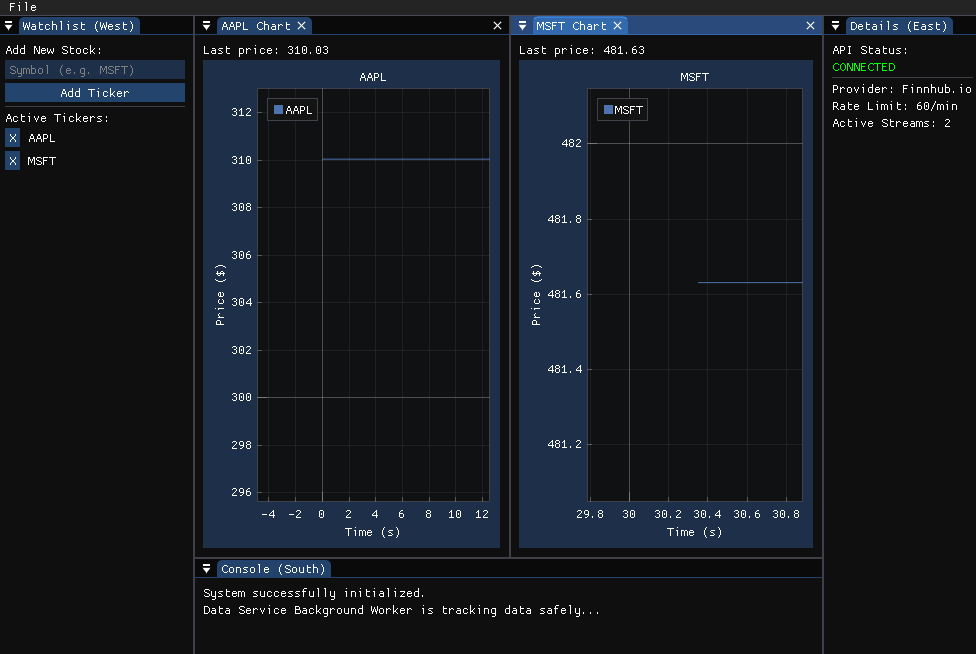

# Stock View

A lightweight, high-performance cross-platform real-time stock terminal built in C++ with OpenGL 3.2, GLFW, Dear ImGui, and ImPlot.



## Features

- **Dual-Fetch Architecture:** Automatically backfills 7-day historical hourly candles on ticker addition, then seamlessly shifts to live polling.
- **Resilient Networking:** Background worker thread featuring a Token Bucket rate limiter, API fallbacks, and self-healing polling loops.
- **Modular Indicators:** Extensible quantitative engine allowing users to stack, color-code, and customize technical indicators (like SMA) directly on charts.
- **Advanced Charting:** Interactive ImPlot graphs with pan, zoom, time-axis scaling, and multi-mode rendering (Line & Candlestick).
- **Live System Console:** Real-time observability into network requests and system events with automatic scrolling.
- **Persistent Workspace:** Secure local configuration and state management via `settings.json`.

## Tech Stack

- **Core:** C++17, OpenGL 3.2, GLFW
- **UI & Plotting:** Dear ImGui (Docking Branch), ImPlot
- **Networking & Data:** libcurl, nlohmann_json
- **Build System:** CMake, vcpkg, Ninja

## Building from Source

Prerequisites: Ensure **CMake**, **Ninja**, and **vcpkg** are installed on your system.

## Linux (Fedora / Ubuntu)

Install system dependencies (Fedora example):

```
sudo dnf install gcc gcc-c++ make automake autoconf libtool pkgconf-pkg-config openssl-devel libcurl-devel
```

Configure and Build:

```cmake -B build -S . -G Ninja -DCMAKE_TOOLCHAIN_FILE=$VCPKG_INSTALLATION_ROOT/scripts/buildsystems/vcpkg.cmake -DCMAKE_BUILD_TYPE=Release
cmake --build build --config Release
```

## macOS

```cmake -B build -S . -G Ninja -DCMAKE_TOOLCHAIN_FILE=$VCPKG_INSTALLATION_ROOT/scripts/buildsystems/vcpkg.cmake -DCMAKE_BUILD_TYPE=Release
cmake --build build --config Release
```

## Windows (Visual Studio / MSVC)

Open a Developer Command Prompt and run (adjust the path to where you installed vcpkg):

```cmake -B build -S . -G Ninja -DCMAKE_TOOLCHAIN_FILE=C:/vcpkg/scripts/buildsystems/vcpkg.cmake -DCMAKE_BUILD_TYPE=Release
cmake --build build --config Release
```

### Creating Native Installers (CPack)

To bundle the application into a distribution package (`.deb` for Linux, `.dmg` for macOS, or `.zip` for Windows):

```cd build
cpack -C Release
```

## Quick Start & Configuration

1. Launch the application (`./build/stock_view`).
2. Navigate to **File -> Settings -> API** in the top menu bar.
3. Paste your free Finnhub.io API key.
4. Type a stock symbol (e.g., AAPL) into the Watchlist and click **Add Ticker** to begin streaming data!
